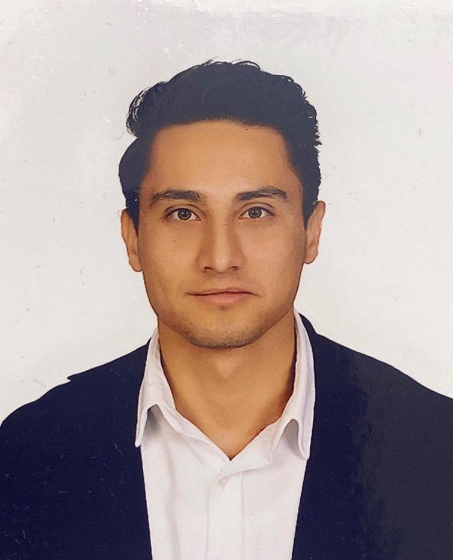

{fig-align="center" width="202"}

# Eğitim

-   B.S., Aksaray University, Turkey, 2016 - 2020.
-   M.S., Industrial Engineering, Hacettepe University, Turkey, 2025 - ongoing.

# İş Tecrübesi

## Employements

1.  Hamid Havacilik A.S. , Project Enginner , 2020-2025

2.  Basariarge Enerji Teknolojileri A.S. , Specialist Manufacturing and Project Engineer , 2025-ongoing

## Internships

1.  Titan Makina Ltd. Sti. , intern , 2018

# Projects

1.  TUBITAK 1501

    Development of a Domestic Actuator for Internal Airflow Control Systems of Civilian and Military Jet Aircraft

# Publications

1.  Dasdemir, E., Batta, R., Koksalan, M., Tezcaner Ozturk, D. (2022) “UAV Routing for Reconnaissance Mission: A Multi-Objective Orienteering Problem with Time-Dependent Prizes and Multiple Connections”, Computers & Operations Research, 145: 105882.

# Competencies

R, Quarto, Git, Python

# Hobbies

FOOTBALL

PARACHUTEZ

TREKKING
